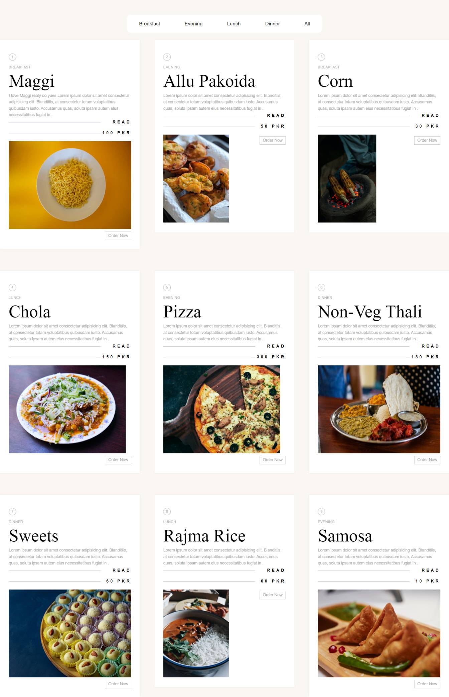

# :closed_book: Restaurant WebApp

### _Restaurant App using react js !!_

### Link :link: https://rak-restaurant.netlify.app/

## Interface

## Run Locally

  - Run This command `https://github.com/developer-rak/restaurant_website.git`
  - You are now in the dev environment and you can play around

## ✨ Features

  - Break Fast
  - Evening
  - Lunch
  - Dinner
  - Open Source (Tweak it and use it)

## ⚙️ Tech Stack
  - HTML5
  - CSS3
  - React
  - Netlify
